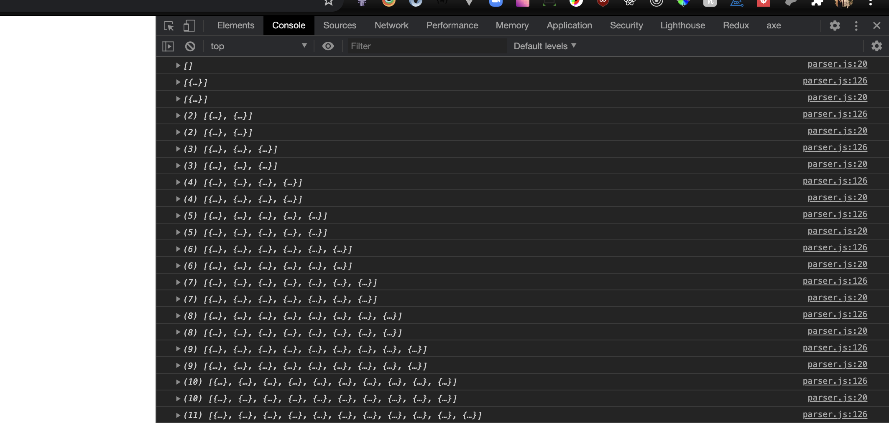

## Questions about XML parser

* __Language chosen and why?__
    * I chose to program my solution in JavaScript because I have the most experience with this langauge and take advantage of the DOM and debugging my code with the console.log functionality 
* __High level design. (A visio diagram or hand drawn image)__
    
* __How to deploy the solution.__
    * To Deploy this locally, you can right click on the index.html file which should allow you to select an option to open within a browser. This will allow you to see the parser.js working within console in the browser. The picture below showing the data being collected is from within the browser. 
    * The solution is also deployed via github Pages. This was done by creating a repository with this code. Going into the setting tabs, and selecting the option to deploy this repository,it's currently live at https://chubbard022.github.io/takeHomeAssignment/
* __Source code__
        * Look inside the util folder
* __highlighting any anomalies or errors__
    * I found that only in the < Capabilities > tags errors that didn't align with the camera data. Within the persisted data, there is a key value pair for the data under     AnomaliesInCapabilities
* __Screen shot showing data persisting__
    
* __Steps to deploy the solution__
    * to deploy locally
        1. open up project in an IDE
        2. right click the index.html file
        3. open up html file within browser.
        4. open up dev tools, specifically looking for the console within the browser.
        5. each minute a green success message will pop up on the screen on the broswer, and data will start to trickle in as well and can be found within the console.
    * Live deploying
        1. This project has already been deployed via github pages at the following address https://chubbard022.github.io/takeHomeAssignment/
            * The steps for deploying this on github
                1. create a github repository.
                2. push code locally to repository.
                3. go back to github repository and go to settings on project.
                4. deploy project via the root directory.
                5. wait for project to compile and then it will successfully be deployed.