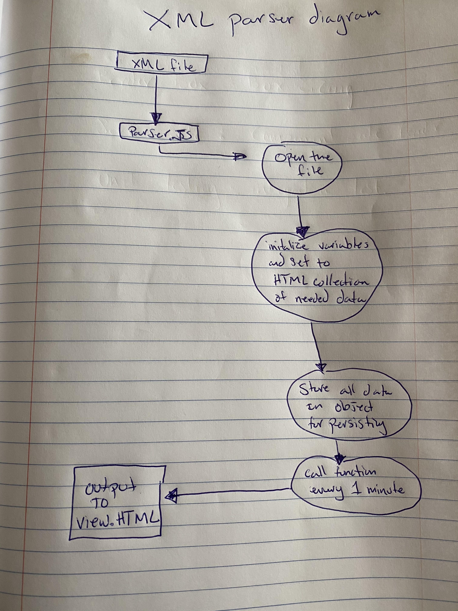

## Questions about XML parser

* __Language chosen and why?__
    * I chose to program my solution in JavaScript because I have the most experience with this langauge and take advantage of the DOM and debugging my code with the console.log functionality 
* __High level design. (A visio diagram or hand drawn image)__
    
* __How to deploy the solution.__
    * You can either add this to an existing project, and make a call to the backend of the application to persist the data on a server. This XML parser can be deployed on GitHub or any FrontEnd deploying website.
	•	Screenshots of formatted data presentation, in case we are not able to run the solution.
* __Source code__
        * Look inside the util folder
* __Steps to deploy the solution__
    * Project is deployed on GitHub at --> chubbard022.github.io/takeHomeAssignmentIR

* __Screen shot showing data persisting__
    